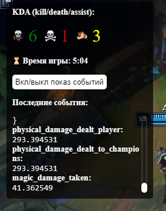

## 🚀 Quick Start

### Prerequisites

- Install [Node.js](https://nodejs.org)
- Install [Overwolf client](https://download.overwolf.com/install/Download)
- Terminal bash/powershell to build/install dependencies
- Install [League of Legends](https://www.leagueoflegends.com/ru-ru/download/)

## 📸 Screenshot



## 📦 Build/Create package for overwolf store.

1. **Load npm dependencies**

   ```shell
   npm install
   ```

2. **Compile**

   ```shell
   npm run build
   ```

- the generated code is located in `build/**`

3. load unpacked extension to overwolf [client] (https://dev.overwolf.com/ow-native/getting-started/basic-sample-app#5-load-the-app-as-unpacked-extension)

## 🎮 Usage: See overlay in League of Legends game.

1. **Load League of Legends and then and register**

- Open and download. [League of Legends](https://www.leagueoflegends.com/ru-ru/download/)
- Open Riot Client or League of Legend Client and register/auth

2. **Enter the game**

- the overlay should be shown on left/top side if you installed correclty
- you can check on training. the path of a newbie -> play -> training -> confirm -> 1st training
